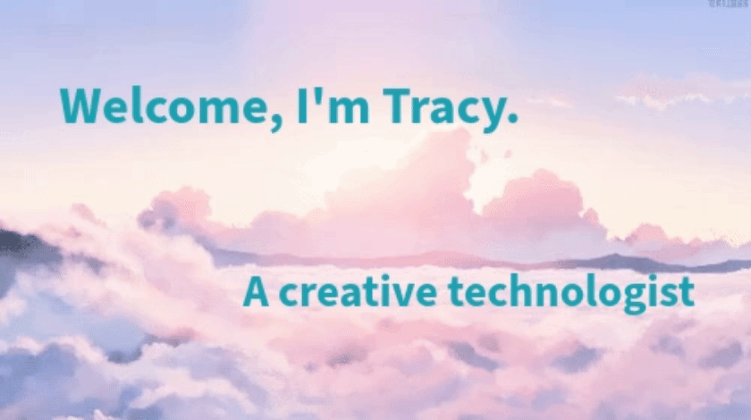

  

Hi there! 👋 With a background rooted in learning about how the intersection of technology and solving the world's toughest problems coincide, my undergrad studies in Information Sciences have taught me to continue to expand my curiosity for new knowledge in the depths of software development as I continue to grow my experience in the industry. 💭 I am invigorated by the challenge of learning new technologies and inquisitive about the opportunity to use technology to create enhanced experiences and solutions for others.✨ I love to build and create quality applications by using various languages, platforms, and domains. 💻 Besides finding the next web project to bring to life, you'll usually find me dabbling in UX Design and Data Structures/Algorithms. 🌈

<!-- 
 -->
## ⚡ GitHub Stats
    
  
<!-- 
 -->
<!--
**jtl2774/jtl2774** is a ✨ _special_ ✨ repository because its `README.md` (this file) appears on your GitHub profile.

Here are some ideas to get you started:

- 🔭 I’m currently working on ...
- 🌱 I’m currently learning ...
- 👯 I’m looking to collaborate on ...
- 🤔 I’m looking for help with ...
- 💬 Ask me about ...
- 📫 How to reach me: ...
- 😄 Pronouns: ...
- ⚡ Fun fact: ...
-->

